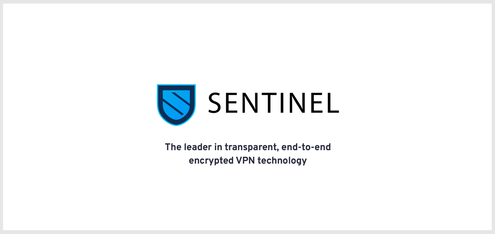

# ☁️ [Sentinel DVPN](https://sentinel.co/) Tutorial 🐇




| Key | Value |
| --- | --- |
| `Source ` | 🕳️ [Documentation](https://github.com/sentinel-official/cli-client) |
| `Tutorial Author ` | ☕ `Julian Wendland` |
| `$AKT Address` | `sent1nzsagwgzjmpcu0csx6xxmhhn5zuynwxfnghzmg` |


## Variables
**Note:** you can always check if all the required variables are set using "echo $variable" before your command.
|Name|Description|Example values |
|---|---|---|
|`ACCOUNT_ADDRESS`| The address of your account. | `akash1srujzhj2v9fkzhnn635udlczyhdpetuh34mhad` |
|`KEYRING_BACKEND`| Keyring backend to use for local keys. (os,file or test) | `file` |
|`KEY_NAME` | The name of the key you will be deploying from. | `julian` |


# Prepare `Sentinel` Installation ☁️
## 🏳️ Start Installation
```sh
brew install v2ray wireguard-tools
curl --silent https://raw.githubusercontent.com/sentinel-official/cli-client/master/scripts/install.sh | sh
```

## 💳 Wallet Setup 
**Setup required variables `KEY_NAME`  for wallet creation**
```sh
export KEY_NAME=Sentinel


```
