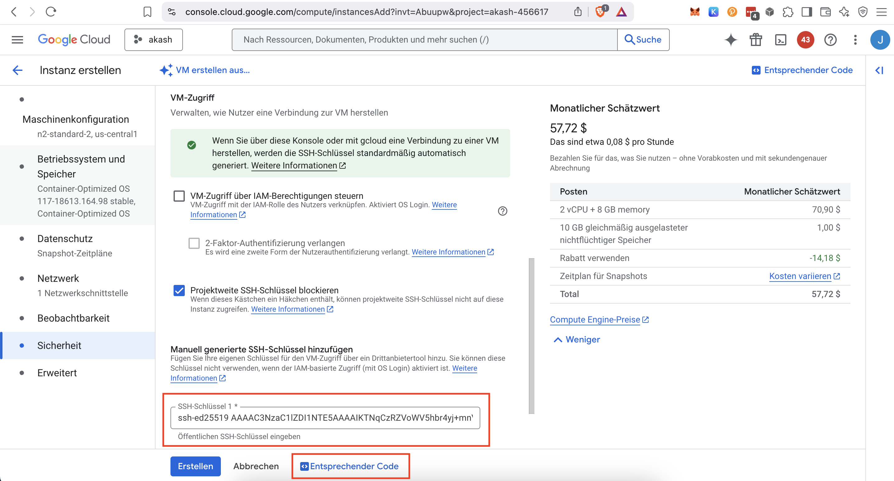

# **Setup Akash Cloud Provider on GCP 🐇**


[**Source: Documentation**](https://akash.network/docs/providers/build-a-cloud-provider/akash-cli/kubernetes-cluster-for-akash-providers/kubernetes-cluster-for-akash-providers/)


```sh
# install gcloud cli
brew update
brew upgrade
brew cleanup

brew install google-cloud-sdk
export PATH="$PATH:/google-cloud-sdk/bin"

# Login to Google Cloud
gcloud auth login
```

```sh
# generate ssh key to access gcp ubuntu vm with ed25519 or rsa**
ssh-keygen -t ed25519  -f ~/.ssh/jw_ed25519 -C jw ; cat ~/.ssh/jw_ed25519.pub
ssh-keygen -t rsa -f ~/.ssh/jw_rsa -C jw ; cat ~/.ssh/id_rsa.pub
```

```text
# deployment sizing ubuntu 22.04 x86/64, amd64 noble image built on 2025-04-09 from Google Cloud
Ansible Node Requirements (t2d-standard-1 (1 vCPU, 4 GB Arbeitsspeicher))
Kubernetes Control Plane Node Requirements (t2d-standard-2 (2 vCPU, 8 GB Arbeitsspeicher))

Minimum Specs

2 CPU
4 GB RAM
30 GB disk

Recommended Specs

4 CPU
8 GB RAM
40 GB disk
```

```sh
# create gcloud vm command using ui and add ssh public key to access vm
 cat ~/.ssh/jw_ed25519.pub
 ```



```sh
# create gcp ubuntu vm ansible host
gcloud compute instances create ansible \
    --project=akash-456617 \
    --zone=us-central1-a \
    --machine-type=t2d-standard-1 \
    --network-interface=network-tier=PREMIUM,stack-type=IPV4_ONLY,subnet=default \
    --metadata=ssh-keys=jw:ssh-ed25519\ \
AAAAC3NzaC1lZDI1NTE5AAAAIKTNqCzRZVoWV5hbr4yj\+mnV0ckEBfr68LC3BqZd3JsD\ jw \
    --maintenance-policy=MIGRATE \
    --provisioning-model=STANDARD \
    --service-account=513538345283-compute@developer.gserviceaccount.com \
    --scopes=https://www.googleapis.com/auth/devstorage.read_only,https://www.googleapis.com/auth/logging.write,https://www.googleapis.com/auth/monitoring.write,https://www.googleapis.com/auth/service.management.readonly,https://www.googleapis.com/auth/servicecontrol,https://www.googleapis.com/auth/trace.append \
    --create-disk=auto-delete=yes,boot=yes,device-name=ansible-1,disk-resource-policy=projects/akash-456617/regions/us-central1/resourcePolicies/default-schedule-1,image=projects/ubuntu-os-cloud/global/images/ubuntu-2404-noble-amd64-v20250409,mode=rw,size=10,type=pd-standard \
    --no-shielded-secure-boot \
    --shielded-vtpm \
    --shielded-integrity-monitoring \
    --labels=goog-ec-src=vm_add-gcloud \
    --reservation-affinity=any

NAME     ZONE           MACHINE_TYPE   PREEMPTIBLE  INTERNAL_IP  EXTERNAL_IP     STATUS
ansible  us-central1-c  n1-standard-1               10.128.0.15  35.192.168.243  RUNNING
```

**anternativly use ansible playbook to create gcp vm**
```yml
- name: Create GCP instance
  gcp_compute_instance:
    name: my-instance
    machine_type: n1-standard-1
    disks:
      - boot:
          auto_delete: true
          initialize_params:
            source_image: projects/debian-cloud/global/images/debian-9-drawfork-v20180627
    network_interface:
      network: default
      access_config: {}
    zone: us-central1-a
    auth_kind: serviceaccount
    project: my-project-id
    service_account_file: /path/to/service-account-file.json

- name: Deploy Docker container
  docker_container:
    name: ubuntu
    image: my-docker-image:latest
    state: started
    restart_policy: always
    pull: yes
  delegate_to: localhost
```

```sh
# copy public ed25519 or rsa SSH key from gcp vm in known hosts file and connect to vm. 
# Note ed25519 is more secure than rsa!

ssh-keyscan -t ed25519 34.173.226.140 >> ~/.ssh/known_hosts
ssh-keyscan -t rsa 34.173.226.140 >> ~/.ssh/known_hosts

ssh -i ~/.ssh/jw_ed25519 jw@34.173.226.140
ssh -i ~/.ssh/jw_rsa jw@34.173.226.140
```


```sh
# Clone Kubespray for Kubernetes Setup https://github.com/kubespray Download Updates and and install Kubespray 
cd ~ && sudo -s
apt-get update && apt-get upgrade
apt-get install docker.io -y
apt-get install python3-pip virtualenv -y
git clone -b v2.24.1 --depth=1 https://github.com/kubernetes-sigs/kubespray.git

# Setup Python 3 environment and install requirements
cd ~/kubespray
virtualenv --python=python3 venv
source venv/bin/activate
python3 -m pip install --upgrade pip
pip3 install -r requirements.txt
```

```sh
# Run kubespray docker container
docker run --rm -it --mount type=bind,source="$(pwd)"/inventory/akash,dst=/kubespray/inventory \
  --mount type=bind,source="${HOME}"/.ssh/id_rsa.pub,dst=/root/.ssh/id_rsa \
  quay.io/kubespray/kubespray:v2.27.0 bash
```

```sh
# Build Ansible Inventory for Kubernetes Hosts
cd ~/kubespray

cp -rfp inventory/sample inventory/akash

#REPLACE IP ADDRESSES BELOW WITH YOUR KUBERNETES CLUSTER IP ADDRESSES
declare -a IPS=(10.0.10.136 10.0.10.239 10.0.10.253 10.0.10.9)

CONFIG_FILE=inventory/akash/hosts.yaml python3 contrib/inventory_builder/inventory.py ${IPS[@]}
```


```sh
# Create Inventory File add ansible_user and vars section
```
```yml
cat <<EOF > inventory/akash/hosts.yaml
  all:
    vars:
      ansible_user: root
    hosts:
      node1:
        ansible_host: 10.0.10.136
        ip: 10.0.10.136
        access_ip: 10.0.10.136
      node2:
        ansible_host: 10.0.10.239
        ip: 10.0.10.239
        access_ip: 10.0.10.239
      node3:
        ansible_host: 10.0.10.253
        ip: 10.0.10.253
        access_ip: 10.0.10.253
      node4:
        ansible_host: 10.0.10.9
        ip: 10.0.10.9
        access_ip: 10.0.10.9
    children:
      kube_control_plane:
        hosts:
          node1:
          node2:
          node3:
      kube_node:
        hosts:
          node1:
          node2:
          node3:
          node4:
      etcd:
        hosts:
          node1:
          node2:
          node3:
      k8s_cluster:
        children:
          kube_control_plane:
          kube_node:
      calico_rr:
        hosts: {}
EOF
```

```sh
# Update DNS Server Config group_vars
vi inventory/akash/group_vars/all/all.yml
```
```yml
## Uncomment upstream dns servers
upstream_dns_servers:
  - 8.8.8.8
  - 1.1.1.1
```


```sh
# Generate ed25519 ssh key to access container on ubuntu passwordless vm with ed25519
ssh-keygen -t rsa -C $(hostname) -f "$HOME/.ssh/id_rsa" -P "" ; cat ~/.ssh/id_rsa.pub
```

```sh
# Inside the container you may now run the kubespray playbooks to create kubernetes cluster
ansible-playbook -i inventory/hosts.yaml --private-key /root/.ssh/id_rsa -become cluster.yml
```

```sh
# Configure access to k8s
mkdir -p $HOME/.kube
cp -i /etc/kubernetes/admin.conf $HOME/.kube/config
chown $(id -u):$(id -g) $HOME/.kube/config
export KUBECONFIG=/etc/kubernetes/admin.conf
```

```sh
# SSH into Kubernetes Master Node verify kubernetes installation
kubectl get nodes
```

```sh
# Create and apply custom kernel parameters
# **_NOTE:_** Apply these settings to ALL Kubernetes worker nodes to guard against too many open files errors.
cat > /etc/sysctl.d/90-akash.conf << EOF
# Common: tackle "failed to create fsnotify watcher: too many open files"
fs.inotify.max_user_instances = 512
fs.inotify.max_user_watches = 1048576

# Custom: increase memory mapped files limit to allow Solana node
# https://docs.solana.com/running-validator/validator-start
vm.max_map_count = 1000000
EOF 

# Apply Configs
sysctl -p /etc/sysctl.d/90-akash.conf
```

**Copy Public Key to the Kubernetes Hosts**
```sh
ssh-copy-id -i ~/.ssh/id_rsa.pub root@10.0.10.136
ssh-copy-id -i ~/.ssh/id_rsa.pub root@10.0.10.239
ssh-copy-id -i ~/.ssh/id_rsa.pub root@10.0.10.253
ssh-copy-id -i ~/.ssh/id_rsa.pub root@10.0.10.9
```
