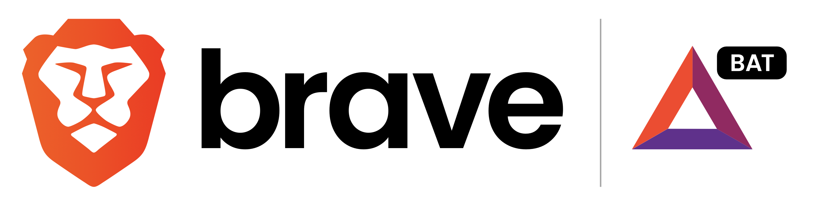

# Implementing Brave rewards on your Website



```text
Earn for your online content
Join Brave Creators and monetize your online presence today. Receive contributions from the millions of users on the Brave Browser, and add your crypto address to start receiving crypto contributions from your supporters all across the Web.
```

**[Create brave publisher account at: https://publishers.basicattentiontoken.org/](https://publishers.basicattentiontoken.org/)**


**Download brave-rewards-verification.txt file**


```text
This is a Brave Creators publisher verification file.

Domain: julianwe.github.io
Token: a9ef0c881180bbbbf307df3cf861f2371a00f40a162c3c739c4f4998abb2c2fa
```

**verify brave publisher setup https://julianwe.github.io/.well-known/brave-rewards-verification.txt**
```sh
# Create well-known directory inside the directory where your index.html file resides
mkdir .well-known

# Move Brave Rewards verification file to well knwon folder
mv brave-rewards-verification.txt .well-known
```


