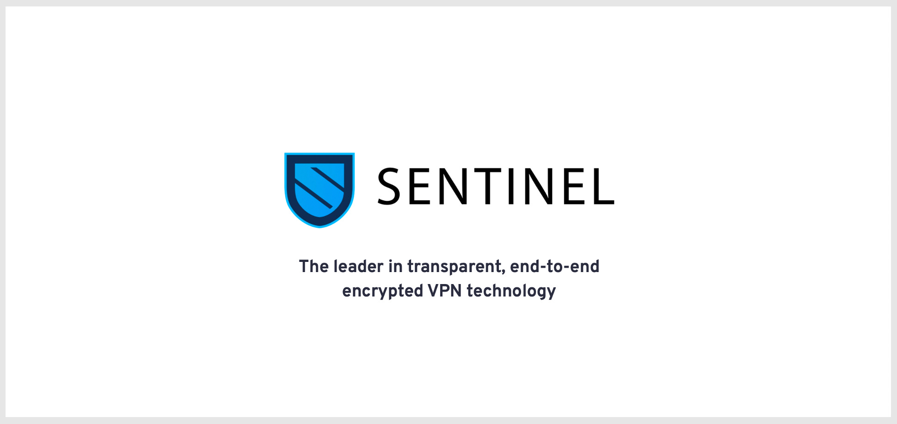
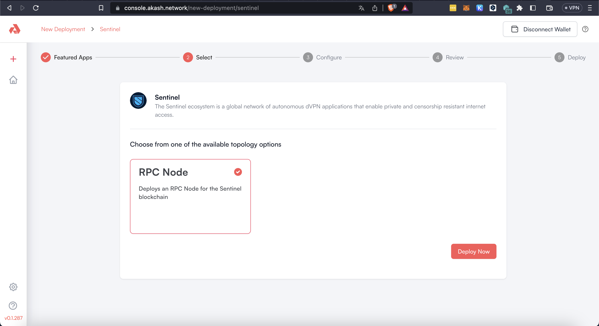
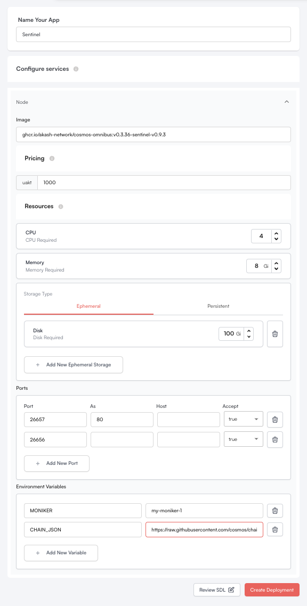
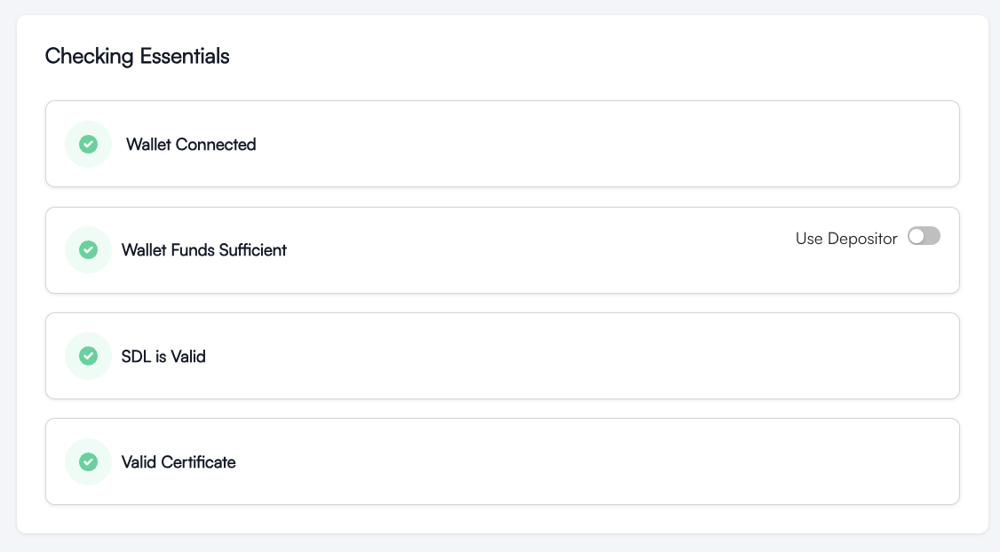
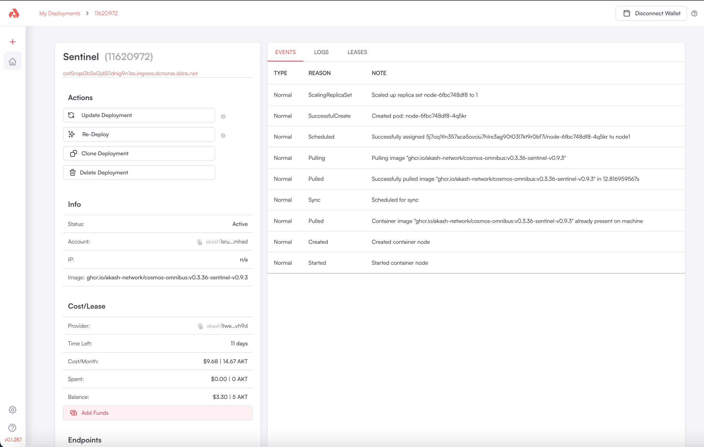

# ☁️ [Sentinel DVPN](https://sentinel.co/) Tutorial 🐇




| Name | Description | Example values |
|---|---|---|
|`ACCOUNT_ADDRESS`| The address of your account. | `akash1srujzhj2v9fkzhnn635udlczyhdpetuh34mhad` |
|`KEYRING_BACKEND`| Keyring backend to use for local keys. (os,file or test) | `file` |
|`KEY_NAME` | The name of the key you will be deploying from. | `julian` |


**Prepare `Sentinel` Installation ☁️ 🏳️ Start Installation**
```sh
brew install v2ray wireguard-tools
curl --silent https://raw.githubusercontent.com/sentinel-official/cli-client/master/scripts/install.sh | sh
```

**💳 Wallet Setup**

**Setup required variables `KEY_NAME`  for wallet creation**

```sh
export KEY_NAME=julian
export KEYRING_BACKEND=os
```

**Generate Mnemonic Passphrase**

```sh
sentinelcli keys mnemonic 
```


**Generate or Import Keys**

```sh
sentinelcli keys add sentinel --keyring-backend $KEYRING_BACKEND  

Enter keyring passphrase:
Re-enter keyring passphrase:

- name: Sentinel
  type: local
  address: sent1nzsagwgzjmpcu0csx6xxmhhn5zuynwxfnghzmg
  pubkey: '{"@type":"/cosmos.crypto.secp256k1.PubKey","key":"AqHdR4e6Pd+b3R86ijGBD0cNopUBW0jR7Al//zE8TTci"}'
  mnemonic: ""

# or import existing keys
sentinelcli keys import $KEY_NAME --keyring-backend $KEYRING_BACKEND
sentinelcli keys list
```

**OR Generate Multiple Keys for Multisig Wallet**

```sh
You can create and store a multisig key by passing the list of key names stored in a keyring
and the minimum number of signatures required through --multisig-threshold. The keys are
sorted by address, unless the flag --nosort is set.
Example:

    keys add mymultisig --multisig "keyname1,keyname2,keyname3" --multisig-threshold 2
```

**Query Nodes & select Node**

```sh
sentinelcli query nodes \
    --home "${HOME}/.sentinelcli" \
    --node https://rpc.sentinel.co:443 \
    --status Active \
    --page 1 

#Select provider and export Provider node:
export PROVIDER=sentnode1qf7cgleytuz2wy7zd9mgjjuqfmxefqqnefjvhv
```


**Create own Sentinel Node on Akash:**
[Akash Cloud Console](https://console.akash.network/new-deployment/sentinel)


| Deploy RPC Node | configure service | Review SDL File | Review Deployment |
|---------|---------|---------|---------|
  |  |  |  | 


**Example SDL File (review SDL File) with default values:**
```yml
version: '2.0'
services:
  node:
    image: ghcr.io/akash-network/cosmos-omnibus:v0.3.36-sentinel-v0.9.3
    env:
      - MONIKER=my-moniker-1
      - CHAIN_JSON=https://raw.githubusercontent.com/cosmos/chain-registry/master/sentinel/chain.json
    expose:
      - port: 26657
        as: 80
        to:
          - global: true
      - port: 26656
        to:
          - global: true
profiles:
  compute:
    node:
      resources:
        cpu:
          units: 4
        memory:
          size: 8Gi
        storage:
          - size: 100Gi
  placement:
    dcloud:
      attributes:
        host: akash
      signedBy:
        anyOf:
          - akash1365yvmc4s7awdyj3n2sav7xfx76adc6dnmlx63
      pricing:
        node:
          denom: uakt
          amount: 1000
deployment:
  node:
    dcloud:
      profile: node
      count: 1
```


**Subscribe to Provider Node**
```sh 
sentinelcli tx subscription subscribe-to-node \
    --home "${HOME}/.sentinelcli" \
    --keyring-backend $KEYRING_BACKEND \
    --chain-id sentinelhub-2 \
    --node https://rpc.sentinel.co:443 \
    --gas-prices 0.1udvpn \
    --from $KEY_NAME $PROVIDER 20000udvpn
```


**Query active Account subscription**
```sh 
sentinelcli query subscriptions \
    --home "${HOME}/.sentinelcli" \
    --node https://rpc.sentinel.co:443 \
    --status Active \
    --page 1 \
    --address "sent1g9s5v5t0jfxcfqd6l4rkn4g8vat90rtky5jd2r"
```


**Connect**
```sh 
sudo sentinelcli connect \
    --home "${HOME}/.sentinelcli" \
    --keyring-backend file \
    --chain-id sentinelhub-2 \
    --node https://rpc.sentinel.co:443 \
    --gas-prices 0.1udvpn \
    --yes \
    --from <KEY_NAME> <SUBSCRIPTION_ID> <NODE_ADDRESS>
```


**Disconnect**
```sh 
sudo sentinelcli disconnect \
    --home "${HOME}/.sentinelcli"
```


| Key | Value |
| --- | --- |
| `Source` | 🕳️ [Source](https://github.com/sentinel-official/cli-client), [Docs](https://docs.sentinel.co/clients/CLI/installation/)|

