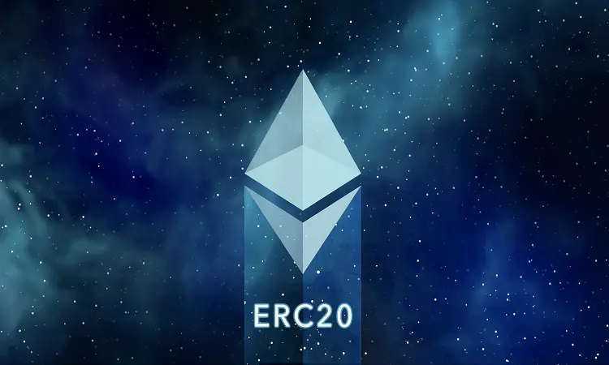

# ERC-20 Smart Contract tutorial 🐇



**This Tutorial shows how to write, deploy and interact with a ethereum token smart contract**


**1. Download and install MetaMask wallet**

[Download Wallet](https://metamask.io/)

**2. Request Rinkeby testnetwork tokens for transaction fee**

[Rinkeby Faucet](https://faucet.rinkeby.io/)

**3. open Remix - Ethereum Web IDE:**

[Remix Ethereum IDE](https://remix.ethereum.org/)


**4. Create Solidity Smart Contract file MyCustomToken.sol in Remix IDE**

```java
pragma solidity ^0.5.0;

// ----------------------------------------------------------------------------
// ERC Token Standard #20 Interface
//
// ----------------------------------------------------------------------------
contract ERC20Interface {
    function totalSupply() public view returns (uint);
    function balanceOf(address tokenOwner) public view returns (uint balance);
    function allowance(address tokenOwner, address spender) public view returns (uint remaining);
    function transfer(address to, uint tokens) public returns (bool success);
    function approve(address spender, uint tokens) public returns (bool success);
    function transferFrom(address from, address to, uint tokens) public returns (bool success);

    event Transfer(address indexed from, address indexed to, uint tokens);
    event Approval(address indexed tokenOwner, address indexed spender, uint tokens);
}

// ----------------------------------------------------------------------------
// Safe Math Library
// ----------------------------------------------------------------------------
contract SafeMath {
    function safeAdd(uint a, uint b) public pure returns (uint c) {
        c = a + b;
        require(c >= a);
    }
    function safeSub(uint a, uint b) public pure returns (uint c) {
        require(b <= a); c = a - b; } function safeMul(uint a, uint b) public pure returns (uint c) { c = a * b; require(a == 0 || c / a == b); } function safeDiv(uint a, uint b) public pure returns (uint c) { require(b > 0);
        c = a / b;
    }
}


contract MyCustomToken is ERC20Interface, SafeMath {
    string public name;
    string public symbol;
    uint8 public decimals; // 18 decimals is the strongly suggested default, avoid changing it

    uint256 public _totalSupply;

    mapping(address => uint) balances;
    mapping(address => mapping(address => uint)) allowed;

    /**
     * Constrctor function
     *
     * Initializes contract with initial supply tokens to the creator of the contract
     */
    constructor() public {
        name = "MyCustomToken";
        symbol = "MCT";
        decimals = 18;
        _totalSupply = 100000000000000000000000000;

        balances[msg.sender] = _totalSupply;
        emit Transfer(address(0), msg.sender, _totalSupply);
    }

    function totalSupply() public view returns (uint) {
        return _totalSupply  - balances[address(0)];
    }

    function balanceOf(address tokenOwner) public view returns (uint balance) {
        return balances[tokenOwner];
    }

    function allowance(address tokenOwner, address spender) public view returns (uint remaining) {
        return allowed[tokenOwner][spender];
    }

    function approve(address spender, uint tokens) public returns (bool success) {
        allowed[msg.sender][spender] = tokens;
        emit Approval(msg.sender, spender, tokens);
        return true;
    }

    function transfer(address to, uint tokens) public returns (bool success) {
        balances[msg.sender] = safeSub(balances[msg.sender], tokens);
        balances[to] = safeAdd(balances[to], tokens);
        emit Transfer(msg.sender, to, tokens);
        return true;
    }

    function transferFrom(address from, address to, uint tokens) public returns (bool success) {
        balances[from] = safeSub(balances[from], tokens);
        allowed[from][msg.sender] = safeSub(allowed[from][msg.sender], tokens);
        balances[to] = safeAdd(balances[to], tokens);
        emit Transfer(from, to, tokens);
        return true;
    }
}
```


| Source | Documentation |
| --- | --- |
| `Source Code` | 🕳️ [Pluralsight - Ivan Mushketyk](https://www.pluralsight.com/courses/ethereum-blockchain-developing-applications) |


