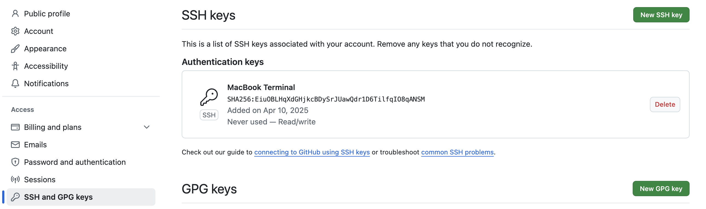

# [**Configure GitHub to use SSH Key**](https://docs.github.com/de/authentication/connecting-to-github-with-ssh/generating-a-new-ssh-key-and-adding-it-to-the-ssh-agent#adding-your-ssh-key-to-the-ssh-agent)


**create new ssh key**
```sh
ssh-keygen -t ed25519-sk -f ~/.ssh/id_ed25519 -C "julianwendland@gmx.de" ; cat ~/.ssh/id_ed25519.pub
```

**Start ssh agent in background**
```sh
eval "$(ssh-agent -s)"
```

**add ssh key**
```sh
ssh-add ~/.ssh/id_ed25519
ssh-add --apple-use-keychain ~/.ssh/id_ed25519
```

**open ssh config and add github as host**
```sh
open ~/.ssh/config

Host github.com
 AddKeysToAgent yes
 IgnoreUnknown UseKeychain
 IdentityFile ~/.ssh/id_ed25519
 Hostname ssh.github.com
 Port 443 
```

**set remote origin to use ssh instead of password authentication**
```sh
git remote set-url origin git@github.com:JulianWe/julianwe.github.io
```

**copy output to github account settings page**
```sh
cat  ~/.ssh/is_ed25519.pub
git config --global user.signingkey ~/.ssh/id_ed25519
```

**add ssh key to github [account settings](https://github.com/settings/keys)**


**test ssh connection**
```sh
ssh -T git@github.com
Enter passphrase for key '/Users/jw/.ssh/id_ed25519': 
Hi JulianWe! You've successfully authenticated, but GitHub does not provide shell access.
```

**Source Documentation:**
https://docs.github.com/de/authentication/connecting-to-github-with-ssh/generating-a-new-ssh-key-and-adding-it-to-the-ssh-agent#adding-your-ssh-key-to-the-ssh-agent
https://docs.github.com/en/authentication/managing-commit-signature-verification/telling-git-about-your-signing-key

