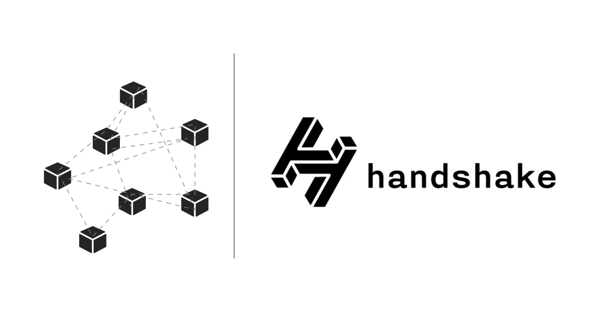

# 👏 [Handshake](https://handshake.org/) Tutorial



## About
**Decentralized naming and certificate authority | $HNS**

In other words, an association between keys and names create the potential for the decentralized web by allocating cryptographically provable resources to names.


# prerequisites
```sh
sudo apt-get install nodejs npm build-essential
npm install node-gyp
```

**First [download](https://handshake.org/download/) the latest and greatest packages**

In this Tutorial wie usend the following:
```sh
curl https://handshake.org/files/hsd-2.3.0.tar.gz
curl https://handshake.org/files/hs-client-0.0.9.tar.gz

tar xvf hs*
```

```sh
cd hsd-2.0.2/hsd
npm install --production
```

```sh
cd hs-client-0.0.8/hs-client
npm install --production
```


```sh
cd hsd directory..
./bin/hsd --log-level info
```

**How to retrive address**
```sh
jw@ansibleVM:~/Handshake/hsd-2.3.0/hsd$ ./bin/hsw-cli account get default | grep receiveAddress
  "receiveAddress": "hs1qe6zn0sehq68w0u7su5gr5fxqwuatd8p0htpwt8",
```
Copy this address and save it.
  
  
⚠️ **Save a copy of your private key**, write down the output of the 12 word phrase on a piece of paper (do not save it in the cloud anywhere): 
```sh
./bin/hsw-cli master | grep phrase

```sh
jw@ansibleVM:~/Handshake/hsd-2.3.0/hsd$   ./bin/hsw-cli master | grep phrase
  "phrase": "race anger neither midnight skull danger oxygen miss federal science lobster damage spider second ship limit wheat board hurry critic polar lobster horror imitate"
```


**How to check if a name is available**
```json
  ./bin/hsd-cli rpc getnameinfo julianwendland
  
  jw@ansibleVM:~/Handshake/hsd-2.3.0/hsd$  ./bin/hsd-cli rpc getnameinfo binance
{
  "start": {
    "reserved": true,
    "week": 0,
    "start": 2016
  },
  "info": null
}
jw@ansibleVM:~/Handshake/hsd-2.3.0/hsd$  ./bin/hsd-cli rpc getnameinfo julianwendland
{
  "start": {
    "reserved": false,
    "week": 49,
    "start": 51408
  },
  "info": null
}
```
  
  
**How to open for binding if returnd false**
```sh
./bin/hsw-cli rpc sendopen julianwendland
```

Send bid (5 is an example bid amount and 10 is your blinding mask, see documentation): 
```sh
./bin/hsw-cli rpc sendbid NAME 5 10
```


**How to Reveal bid** 

⚠️ **You must reveal** after bidding is closed **within 10-block-days** or you will lose your coins, see [documentation](https://hsd-dev.org/)
```sh
./bin/hsw-cli rpc sendreveal NAME
```

**If lost auction, how to refund coins back to yourself**
```sh
./bin/hsw-cli rpc sendredeem
```

**How to get a list of all names and the current state**
```sh
./bin/hsd-cli rpc getnames
```
