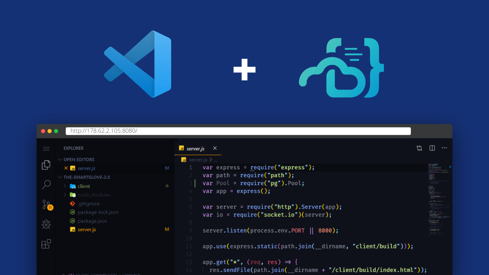

# Visual Studio Code Server on GitHub




```sh
docker run -d \
  --name=code-server \
  -e PASSWORD=password `#optional` \
  -e SUDO_PASSWORD=password `#optional` \
  -e SUDO_PASSWORD_HASH= `#optional` \
  -e PROXY_DOMAIN=localhost `#optional` \
  -p 8443:8443 \
  lscr.io/linuxserver/code-server:latest

or

docker run -d -p 8443:8443 -v /scm:/scm codercom/code-server:1.621 --allow-http --no-auth

docker run \
-v ${{ github.workspace }}:/srv/jekyll -v ${{ github.workspace }}/_site:/srv/jekyll/_site \
jekyll/builder:latest /bin/bash -c "chmod -R 777 /srv/jekyll && jekyll build --future"
```

# VS Code Server Linux
```sh
apt update 
apt install nginx
```


```sh
wget https://github.com/cdr/code-server/releases/download/3.2.0/code-server-3.2.0-linux-x86_64.tar.gz
tar -xzvf code-server-3.2.0-linux-x86_64.tar.gz

sudo cp -r code-server-3.2.0-linux-x86_64 /usr/lib/code-server
sudo ln -s /usr/lib/code-server/code-server /usr/bin/code-server
sudo mkdir /var/lib/code-server
```

sudo vi /lib/systemd/system/code-server.service
		
```yml
[Unit]
Description=code-server
After=nginx.service
[Service]
Type=simple
Environment=PASSWORD=Lab0815!
ExecStart=/usr/bin/code-server --bind-addr 127.0.0.1:8080 --user-data-dir /var/lib/code-server --auth password
Restart=always
[Install]
WantedBy=multi-user.target
```


```sh
sudo systemctl start code-server
sudo systemctl status code-server
sudo systemctl enable code-server
```


```json
sudo vi  /etc/nginx/sites-available/code-server.conf
server {
    listen 80;
    listen [::]:80;
		server_name julianwe.github.io;
		location / {
      proxy_pass http://localhost:8080/;
      proxy_set_header Upgrade $http_upgrade;
      proxy_set_header Connection upgrade;
      proxy_set_header Accept-Encoding gzip;
    }
}
```

```sh
sudo ln -s /etc/nginx/sites-available/code-server.conf /etc/nginx/sites-enabled/code-server.conf
sudo nginx -t
sudo systemctl restart nginx
```

**or install coder:**

[Coder](https://github.com/coder/coder#coder)
[Docs](https://docs.linuxserver.io/images/docker-code-server)

```sh
# First, install Coder
curl -L https://coder.com/install.sh | sh

# Start the Coder server (caches data in ~/.cache/coder)
coder server

# Navigate to http://localhost:3000 to create your initial user
# Create a Docker template, and provision a workspace
```

[Source](https://www.digitalocean.com/community/tutorials/how-to-set-up-the-code-server-cloud-ide-platform-on-ubuntu-18-04)