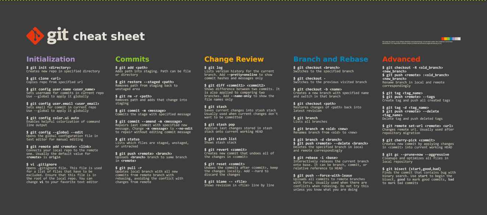

# GitHub Cheatsheet




```sh
git status
git add .
git commit
git push

git clone 

git pull

git config --list --show-origin

git config --global user.email
git config --global user.name "Your Name"

git set remote -v 
git remote -v

Create new branch:
git checkout -b name

Switching between branches
git checkout master


git pull upstream master

git push

git submodule deinit -f . 


git stash

```


[GitHub CLI](https://cli.github.com/)
