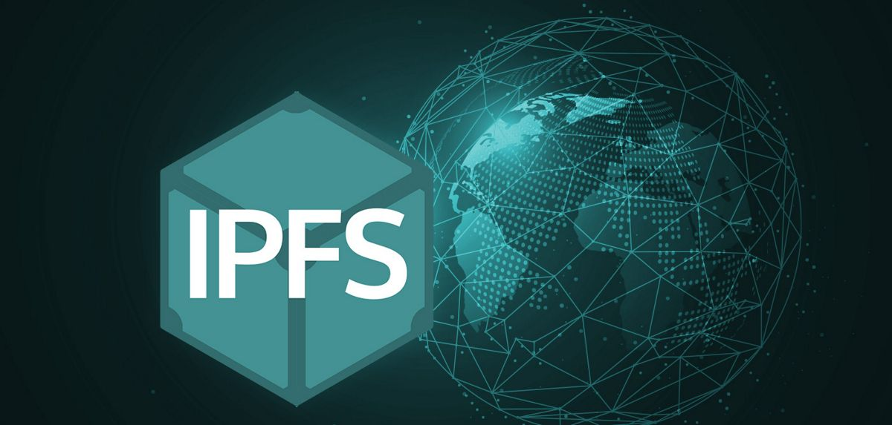
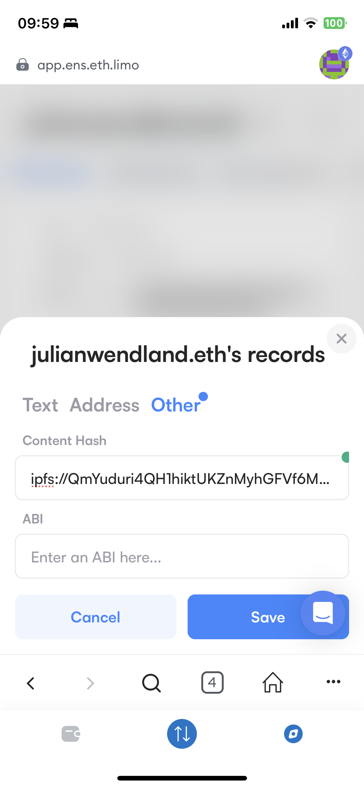
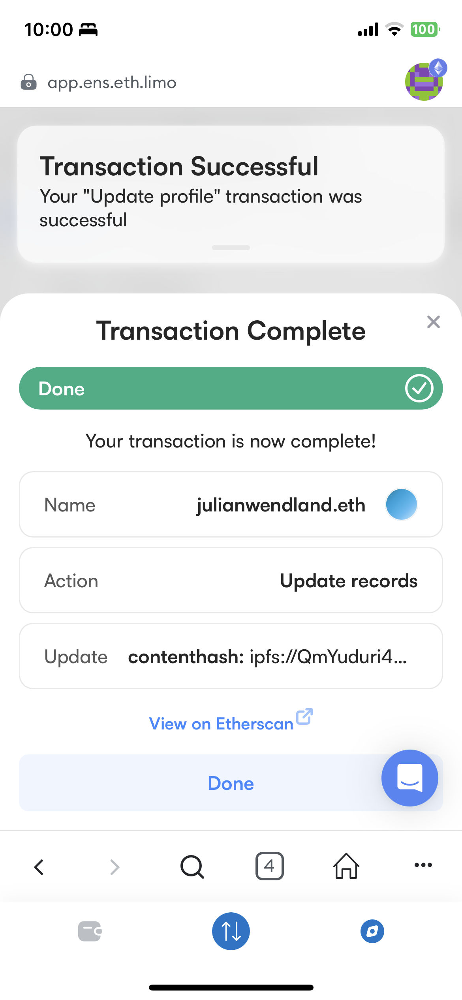

# ☁️ [IPFS](ipns://ipfs.tech/) deployment Tutorial 🐇


| Key | Value |
| --- | --- |
| `Source` | 🕳️ [Documentation](http://docs-ipfs-tech.ipns.localhost:48084/how-to/command-line-quick-start/) |
| `Tutorial Author` | ☕ `Julian Wendland` |
| `$FIL Address` | `0xfA66faf3Faa192277bAb21Ef547ebdB47617B1da` |




**Hash based addressing instead of location based addressing with the worlds first Inter Planetary File System IPFS**

# Install IPFS
```sh 
curl -O https://dist.ipfs.tech/kubo/v0.20.0/kubo_v0.20.0_darwin-amd64.tar.gz
tar -xvzf kubo_v0.20.0_darwin-amd64.tar.gz
cd kubo
sudo bash install.sh
```

# Initialize IPFS
```sh 
ipfs daemon

Initializing daemon...
Kubo version: 0.20.0
Repo version: 13
System version: amd64/darwin
Golang version: go1.19.8

Error: no IPFS repo found in /Users/jw/.ipfs.
please run: 'ipfs init'
```

```sh 
ipfs init

generating ED25519 keypair...done
peer identity: 12D3KooWBcpXDYJbBx1bR4f3AfD4EahzVpcMLuM9fKnPmX3het4X
initializing IPFS node at /Users/jw/.ipfs
```

# Add IPFS Files
```sh 
ipfs add -r julianwe.github.io/

added QmNrj4qtVTA3g4MeLwUGy6Txix3xstWu3Qi3US7RjccSFN julianwe.github.io/Dockerfile
added QmXCDfzm6WgXahFZYBuzxkWGWCvxxwAR3DFDx53UxbPpvn julianwe.github.io/about.html
added QmaPnEzBk6rAyHX3QnmQjdg87ttKjKvybeGrByPP2r7TdU julianwe.github.io/akash-project.html
added QmPKL9uRyVo7HU7Cuycck3YAZgzLedaBZj2qjuMh12dQAk julianwe.github.io/contact.html
added QmZiAmHUyo7gn9WJfiEuGVhwfonX3PRSKp2hjbW7vrd5L1 julianwe.github.io/convert-markdown-to-html.html
added QmScSbR1NxB8Z324jFvDMyzoPRpuiuhDDCFNKaujcEvN2w julianwe.github.io/convert-markdown-to-html.md
added Qma24iH72agTNeMeejKUNEcsZpq7rasfAga3HnAN7JHveh julianwe.github.io/convert-md-to-html.html
added QmbcSTFLuTQ3byMHfCUdc3GY9ckc7vZB4qA3xJJAa3sBa3 julianwe.github.io/deploy.yml
added QmRMGwW2zXsNKx7K7SjDnDVKjSTbBCmXJeqiwBxvy4c4bj julianwe.github.io/handshake-project.html
added Qmat2ZforYHNsWrzFp4RQANXsku2GXWZ9MngxjsNgU9PAC julianwe.github.io/images/Akash.jpg
added QmQonhUj3ZbrtSmYgNcBXmY8p8cdVE6dNoobS1eWdrT541 julianwe.github.io/images/background.jpg
added QmSR44XHr6JTy7Buf36TiU2jFsJBAWCDaB3CdTKpKCXxaG julianwe.github.io/images/defilego.jpg
added QmeMtQw97czTWb42ThscKQwkyg17cvrKz4SKCdDEiYRCP8 julianwe.github.io/images/git.jpg
added QmRjLMBhrT7tu47wB85zjpjBHDgKS7xmPcx97m66czsCxQ julianwe.github.io/images/handshake.jpg
added QmSABQNfBZGsou269RQT5Bx249SKWrQw3QrexmGcvPiDEt julianwe.github.io/images/me.jpg
added QmanCiTyTCajxwjSFrbxrpsq3j2Sie7i33TNSnkTWYM8Fo julianwe.github.io/images/sentinel.jpg
added QmeCXCsAuoUyWceSxJB2JGNQNi13orrfxgE5LUHqjVAngb julianwe.github.io/index.html
added QmdqSVLDuMkuzhAsNY76cLiMcscueJmVots1yztachtdsg julianwe.github.io/projects.html
added QmPyUBNkWo3F5MU6kb65ZhMUSKHd61fZUVtccjXFybxG6a julianwe.github.io/sentinel-project.html
added QmaSjso9LVWfQwSxMB8yB3h4264io3FNhVhGFdVnHeovuj julianwe.github.io/sentinel.md
added QmSFaMQKFD6GHqwWm6J8rGVqNnfip1YDsZappqR7EfzMSg julianwe.github.io/template-projects.html
added QmPRwFCQM2JksCgRjEEs94tCSiws3CFMj5LBjnHY6k65Ne julianwe.github.io/images
added QmUJLpy2VaPjzms3SzCB6PXEtE2rNt2Lg3yjzijt8KhEWb julianwe.github.io
 1.16 MiB / 1.16 MiB [==================================================================================================] 100.00%
```

**[ipfs://QmUJLpy2VaPjzms3SzCB6PXEtE2rNt2Lg3yjzijt8KhEWb/](ipfs://QmUJLpy2VaPjzms3SzCB6PXEtE2rNt2Lg3yjzijt8KhEWb/)**
**[ipfs://bafybeibj4htj2dnzhocbwswqu6icwrihovsbcxtv3o23gfvjr2ysyuqbue/projects/ipfs/ipfs.html](ipfs://bafybeibj4htj2dnzhocbwswqu6icwrihovsbcxtv3o23gfvjr2ysyuqbue/projects/ipfs/ipfs.html)**

**Go to https://app.ens.domains/ and Link your content Hash to ENS Domain**
| Set Content Hash | Update Records |
|-------|---------|
 |  |

# IPFS Link to your Website
[IPFS Link](https://gateway.ipfs.io/ipfs/QmdqSVLDuMkuzhAsNY76cLiMcscueJmVots1yztachtdsg)
https://gateway.ipfs.io/ipfs/QmdqSVLDuMkuzhAsNY76cLiMcscueJmVots1yztachtdsg

# Link DNS to your website 
[Docs](http://docs-ipfs-tech.ipns.localhost:48084/how-to/websites-on-ipfs/link-a-domain/)
[Docs](https://dnslink.io/#step-1-choose-a-domain-name-to-link-from)

# Links
[Source](https://makoto-inoue.medium.com/how-to-host-your-dapp-with-ipfs-ens-and-access-it-via-ethdns-c96046059d87)
[IPFS Desktop](https://github.com/ipfs/ipfs-desktop)
[IPFS Addon](https://chrome.google.com/webstore/detail/ipfs-companion/nibjojkomfdiaoajekhjakgkdhaomnch?hl=en)
[IPFS Docs](http://docs-ipfs-tech.ipns.localhost:48084/how-to/command-line-quick-start/)
