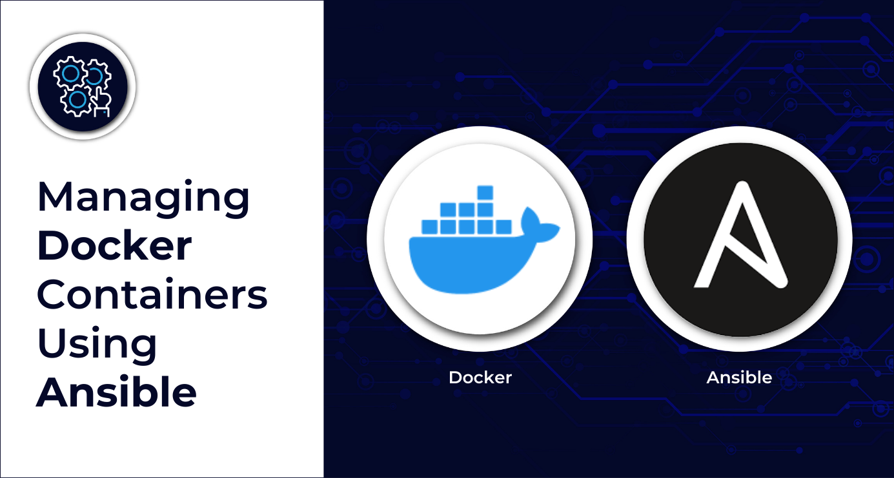
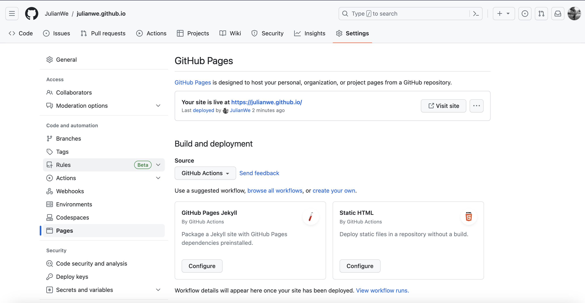

# Create a Website using Docker and GitHub Pages



**How to convert README.md file to HTML with utf-8 encoding**

```sh
brew install pandoc

pandoc -f markdown README.md > index.html

or

iconv -t utf-8 README.md | pandoc -t html -o README.html | iconv -f utf-8
``` 


**How to build docker container**

```dockerfile
FROM ubuntu:latest

RUN apt-get update && apt-get install -y curl
RUN apt-get update && apt-get install -y nginx

RUN apt-get install npm -y
RUN apt-get install nodejs -y
RUN apt-get install vim -y

COPY . /var/www/html/

CMD ["nginx", "-g", "daemon off;"]
```


**How to run docker container**

```sh
#Dockerimage
docker build -t webapp .
docker images -a
docker run -d -p 8080:80 webapp

# DockerHub
docker login --username victorynox0815
docker tag webapp victorynox0815/myrepo:webapp
docker push victorynox0815/myrepo:webapp
``` 


**Combine Readme and Template**
```sh

#!/bin/bash

for folder in projects/*/; do echo ${folder#*/};  done

mkdir test

for folder in projects/*; do pandoc -f markdown $folder/README.md > test/${folder#*/}.html;  done
``` 

**Build Docker Container using ansible**

```yml
---
- name: build html website
  hosts: localhost
  connection: localhost
  gather_facts: False

  vars:
    path: "/Users/jw/Documents/GitHub/julianwe.github.io"

  vars_prompt:
    - name: pw
      prompt: Enter the Docker password

  tasks:

    - name: convert README to HTML
      shell: | 
        cd {{ path }}
        for folder in projects/*; do pandoc -f markdown $folder/README.md > projects/${folder#*/}/${folder#*/}.html;  
        done;
        ls {{ path }}/projects
      register: folder

    - name: set project, URLs & directorys facts
      set_fact:
        name: "{{ item | trim ('/')}}"
        file_path: "{{ path }}/projects/{{ item }}/{{ item | trim ('/')}}.html"
        projects_templatej2:  "{{ path }}/projects/ansible/projects_template.j2"
        projectsj2: "{{ path }}/projects/ansible/projects.j2"
        url: "https://julianwe.github.io/projects/{{ item }}/{{ item | trim('/')}}.html"
        identifier: "{{ index }}"
      loop: "{{ folder.stdout_lines }}"
      loop_control:
        index_var: index
      register: facts

    - name: set html content facts
      set_fact:
        html: "{{ lookup('file', item.ansible_facts.file_path) }}"
        file_path: "{{ item.ansible_facts.file_path }}"
        url: "{{ item.ansible_facts.url }}"
        identifier: "{{ item.ansible_facts.identifier }}"
        name: "{{ item.ansible_facts.name }}"
      loop: "{{ facts.results }}"
      register: html_files

    - name: create project HTML sites
      template:
        src: "{{ projects_templatej2 }}"
        dest: "{{ item.ansible_facts.file_path }}"
      delegate_to: localhost
      when: item.ansible_facts.name != "projects"
      loop: "{{ html_files.results }}"

    - name: set fact
      set_fact:
        projects_html: "{{ item.ansible_facts.html }}"
      when: item.ansible_facts.name == "projects"
      loop: "{{ html_files.results }}"

    - name: create project site
      template:
        src: "{{ projectsj2 }}"
        dest: "{{ path }}/projects.html"
      delegate_to: localhost
      when: item.ansible_facts.name == "projects"
      loop: "{{ html_files.results }}"

    - name: Stop a container
      docker_container:
        name: webapp
        state: stopped

    - name: Log into private registry and force re-authorization
      docker_login:
        username: "victorynox0815"
        password: "{{ pw }}"
        reauthorize: true
      register: login

    - name: Build an image and push
      docker_image:
        build:
          path: "{{ path }}" 
        name: victorynox0815/docker-repo:webapp
        tag: v1
        force_source: yes
        push: yes
        source: build
      delegate_to: localhost

    - name: Start a container
      docker_container:
        name: webapp
        state: started

    - name: Deploy Website on IPFS
      command: ipfs add -r {{ path }}
``` 



**Create .github/workflows/docker-image.yml Action file**

```yml
name: Docker Image CI

on:
  push:
    branches: [ "main" ]
  pull_request:
    branches: [ "main" ]

jobs:

  build:

    runs-on: ubuntu-latest

    steps:
    - uses: actions/checkout@v3
    - name: Build the Docker image
      run: docker build . --file Dockerfile --tag my-image-name:$(date +%s)
``` 


<details>
<summary>Example SDL File for Akash</summary>

```jsx
```yaml
---
version: '2.0'
services:
  webapp:
    image: 'victorynox0815/docker-repo:webapp'
    expose:
      - port: 80
        as: 8080
        to:
          - global: true
profiles:
  compute:
    webapp:
      resources:
        cpu:
          units: 2
        memory:
          size: 512Mi
        storage:
          - size: 10Gi
  placement:
    dcloud:
      pricing:
        webapp:
          denom: uakt
          amount: 1000
deployment:
  webapp:
    dcloud:
      profile: webapp
      count: 1
``` 
``` 
